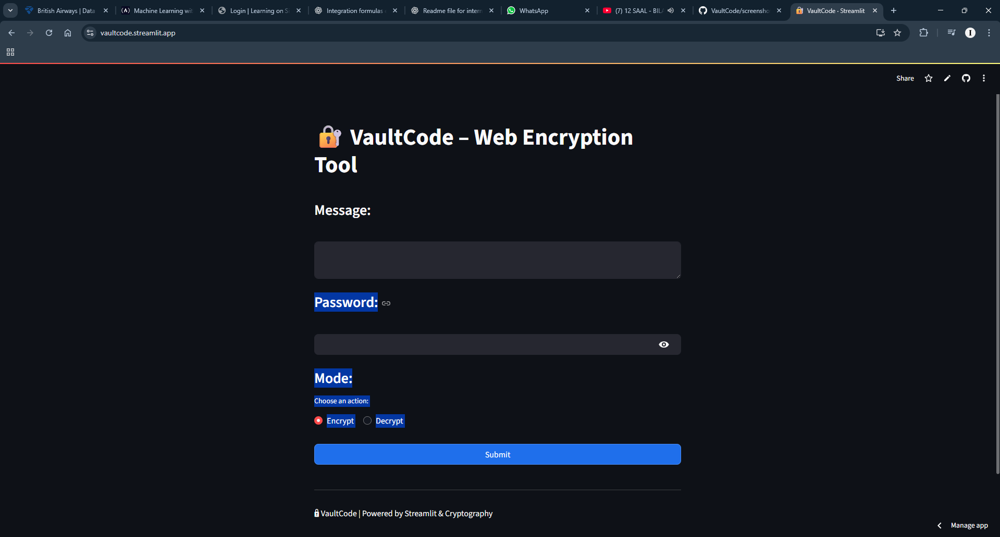
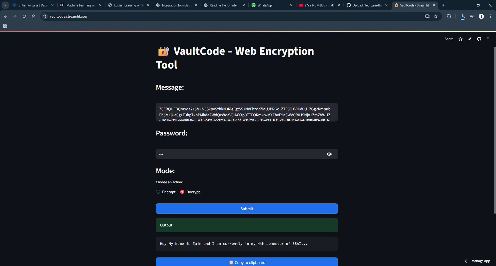

# VaultCode 🔐

**A simple password-based text encryptor — encode a message, decode it back, all in your browser.**

VaultCode is a Streamlit web app that turns the classic "encrypt/decrypt with a password" idea into something you can actually use without touching a terminal. Built originally as a desktop Tkinter app, then rebuilt as a web app so anyone can try it from a link.

🔗 **Live app:** [vaultcode.streamlit.app](https://vaultcode.streamlit.app)

---

## What it does ✨

- 🔒 **Encrypt** any text message using a password of your choice
- 🔓 **Decrypt** it back — same message, same password, original text returned
- 🌐 **Runs entirely in the browser** via Streamlit, no install needed to try it
- 🎨 Clean, minimal UI — message box, password field, mode toggle, done

## How it works 🧩

VaultCode uses [Fernet](https://cryptography.io/en/latest/fernet/) symmetric encryption from Python's `cryptography` library. Your password is hashed (SHA-256) to derive an encryption key, which Fernet then uses to encrypt or decrypt your message. The result is base64-encoded so it's safe to copy, paste, or send as plain text.

```
message + password → SHA-256 → Fernet key → encrypted token → base64 string
```

## Tech stack 🛠️

| Layer | Tech |
|---|---|
| App framework | Streamlit |
| Encryption | `cryptography` (Fernet) |
| Deployment | Streamlit Cloud |

## Running it locally 🚀

```bash
git clone https://github.com/zain-the-npc/VaultCode.git
cd VaultCode
pip install -r requirements.txt
streamlit run app.py
```

## Screenshots 📸






## Honest limitations ⚠️

- **Key derivation is a plain SHA-256 hash of the password** — no salt, no iteration count. This is fine for a fun/learning project, but isn't how you'd derive keys in anything meant to resist real attacks (that would call for something like PBKDF2, scrypt, or Argon2).
- **"Copy to clipboard" doesn't work** — it relies on the system clipboard, which isn't available on Streamlit Cloud's hosted environment. Known issue, not currently planned to fix. Just copy the output text manually.

## Why this exists 💭

Made for fun as a side project — a simple, practical way to explore how password-based encryption works end to end, then ship it as something other people could actually open and try.
